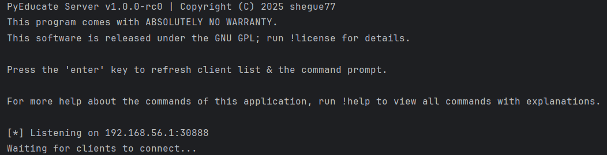
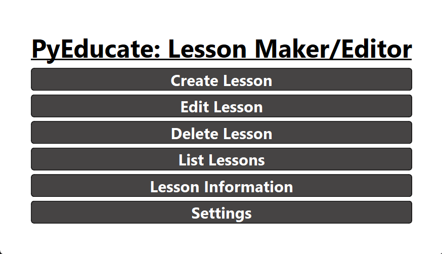

# 🎓 PyEducate

**PyEducate** is a dynamic and powerful **educational application** built with Python.  
Leveraging **socket programming** and **PySide6**, it delivers an engaging, **🎮 gamified learning experience** designed to make education more interactive and fun.

---

<p align="center">
  
  
  
  
  <a href="https://github.com/shegue77/PyEducate/blob/master/LICENSE">
    
  </a>
</p>

---

## 🛡️ Supports:

- ✅ Offline Mode
- ✅ Suite of server commands 🌐
- ✅ One-to-one file transfers 📁
- ✅ Graphical User Interface 💻
- ✅ Auto-connect to server 🔄️
- ✅ Leaderboards 🏆
---

## 🎯 Features

- 📤 **Server Program**  
  - Send lessons (JSON format)
  - Configurable port
  - Safe mode


- ✏️ **Lesson Editor**
    - Easy-to-navigate GUI
    - Create & delete lessons
    - Edit lessons
    - View available lessons


- 📥 **Client Program**
  - Set listening port & IP
  - User-friendly interface
  - Easy access to lessons (stored locally)
  - Automatically connects to the server
  - Leaderboard with others connected to the same server

---

## ❔ Why use PyEducate?
#### Check out the [wiki](https://github.com/shegue77/PyEducate/wiki) to learn more about PyEducate.

## ❓How it works
- **Host** uses the **lesson editor** to create lessons, saved in JSON format; sorted by ID.
- **Host** uses the **server program** which contains a suite of commands used to send & receive data.
- **Client** connects to **server** via the **server program**.
- Lessons are sent **remotely** through the **server program** to the **client**.

---

## 🚀 Getting Started

### ✅ Requirements
- Python 3.9+
- 💻 Windows Device
- 🚫 No internet connection required (runs on the local network)

### 🔧 Installation

###### Download a **[released](https://github.com/shegue77/PyEducate/releases)** version

###### OR

###### 1. Clone the repo:
    git clone https://github.com/shegue77/PyEducate.git
    cd PyEducate

###### 2. Install dependencies:
    pip install -r requirements.txt

###### 3. Run the lesson editor:
    python lesson-editor.py

###### 4. Run the server:
    python server.py

###### 5. Run the client:
    python client.py

---

### 📦 Packaging (Optional)
###### You can convert the files into an .exe using the following:
``` bash
pip install pyinstaller
pyinstaller --onedir [file_path]
```

###### Alternatively, use this script to automatically convert all files to .exe:
``` bash
pip install pyinstaller
python package-all.py
```

---

## Contributing
We welcome contributions to PyEducate! Whether you're fixing bugs, adding features, or improving documentation, we appreciate your help.

``` bash
git clone https://github.com/shegue77/PyEducate.git
cd PyEducate

pip install -r requirements.txt # Install dependencies
```


For detailed contributing guidelines, see [CONTRIBUTING.md](CONTRIBUTING.md).

---

## 📸 Screenshots

> 

> 

### Full Demo [Here](https://youtu.be/-hf7UFrB3TM?si=KDYq3QeLKzNqcTJG)

---

### 📢 License
GPL License – See **[LICENSE](LICENSE)** file for more information.

---