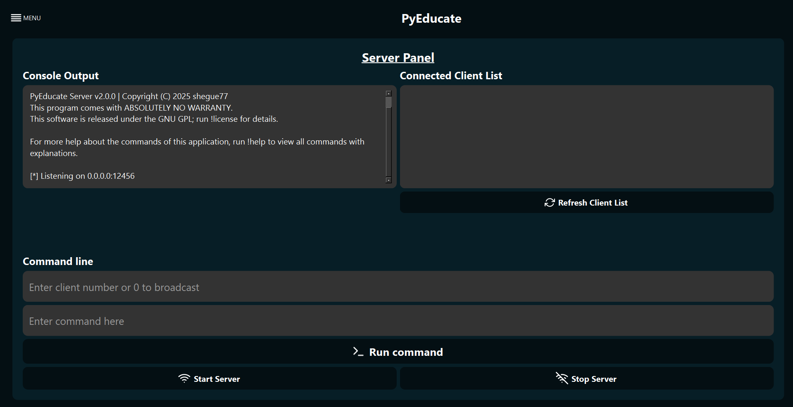

# 📁 PyEducate

A powerful **file-sharing education app** made in Python! Works across devices across the same network with minimal setup.

---
## 🛡️ Supports:
- ✅ One-to-one file transfers
- ✅ Graphical User Interface

---

## 🎯 Features

- 📤 **Server Program**  
  - Send lessons (JSON format)
  - Custom destination filename  
  - Configurable port

- ✏️ **Lesson Editor**
    - Easy-to-navigate GUI
    - Create & delete lessons
    - Edit lessons
    - View available lessons

- 📥 **Client Program**
  - Set listening port 
  - User-friendly interface
  - Easy access to lessons (stored locally)
  - Automatically connects to the server

---

## ❓How it works
- **Host** uses the **lesson editor** to create lessons, saved in JSON format; sorted by ID.
- **Host** uses the **server program** which contains a suite of commands used to send & receive data.
- **Client** connects to **server** via the **server program**.
- Lessons are sent remotely through the **server program** to the **client**.

---

## 🚀 Getting Started

### ✅ Requirements
- Python 3.8+
- Windows Device
- No internet connection required (runs on local network)

### 🔧 Installation

###### 1. Clone the repo:
    git clone https://github.com/shegue77/PyEducate.git
    cd PyEducate

###### 2. Install dependencies:
    pip install -r requirements.txt

###### 3. Run the server:
    python ./server/server.py

###### 4. Run the lesson editor:
    python ./server/lesson-editor.py

###### 5. Run the client:
    python ./client/client.py

---

### 📦 Packaging (Optional)
###### You can convert the files into an .exe using the following to comply with LGPL:
    pip install pyinstaller
    pyinstaller --onedir file_path

###### Alternatively, use this script to automatically convert all files to .exe:
    pip install pyinstaller
    python package-all.py

---

## 📸 Screenshots

> 
> 

---

### 📢 License
LGPL License – See LICENSE file for more information.

---